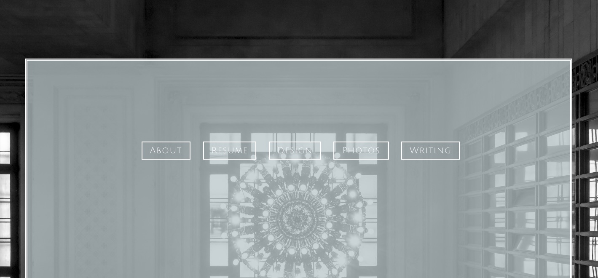
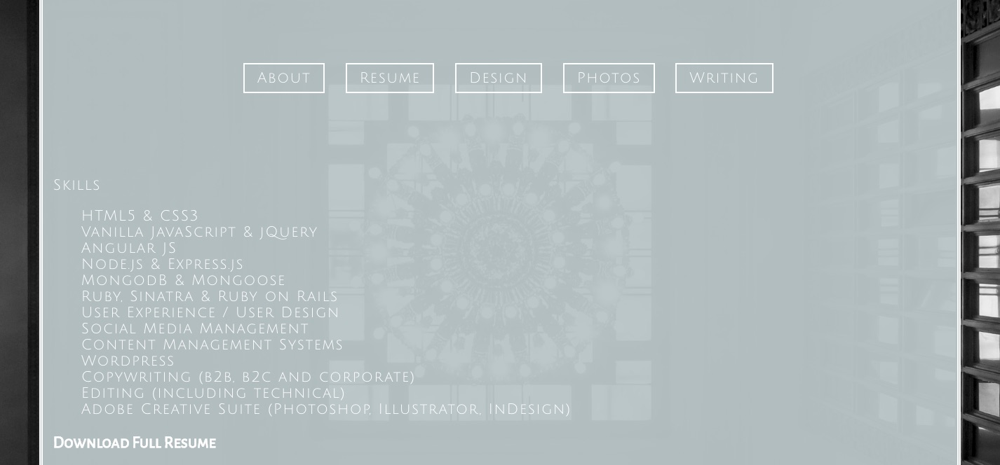
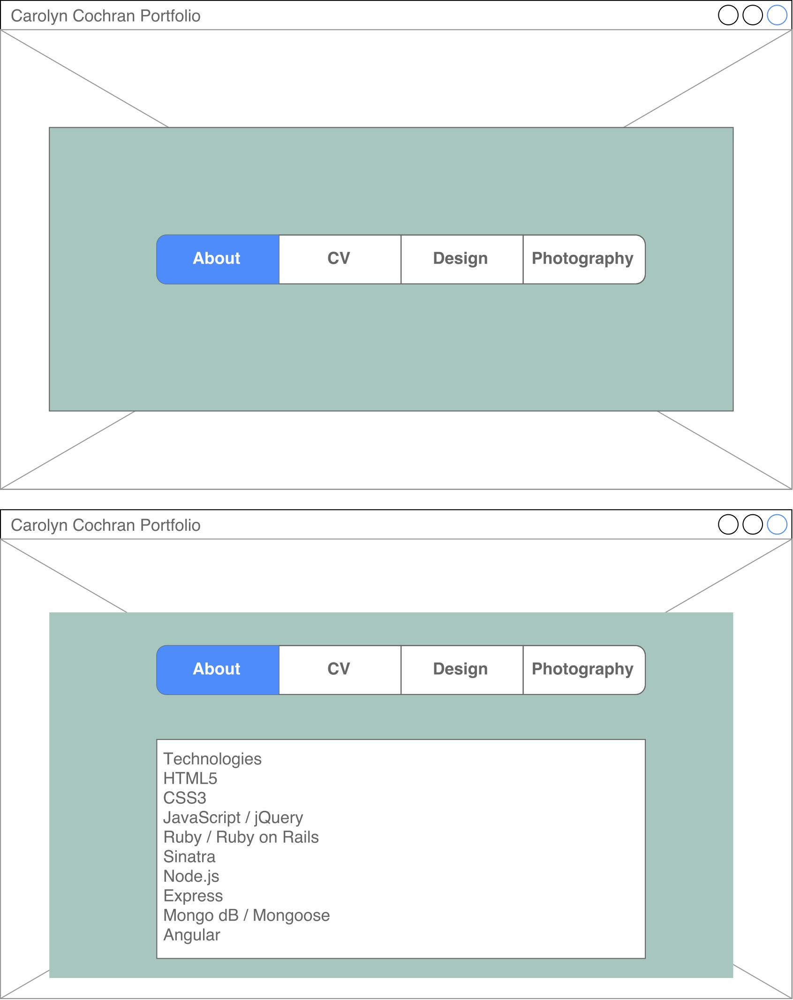

Carolyn Cochran Portfolio README
------------------------------------------

### Introduction

This single page application is the digital portfolio for Carolyn Cochran, a web developer / designer / photographer / writer. 

#### Log In Information

This application has no user authentication. 

###### http://www.carolyn-cochran.com

#### Screen Shots

#### Wireframes

#### User Story

As a newly-minted Full-Stack Web Developer, I want a portfolio site that reflects my personal aesthetic, utlizes my best jQuery friend, and shows off my various developer and other creative projects. 

#### General Approach

My general approach to this project was to create a simple and yet pleasing site that works well on mobile as well as the desktop. 

#### Hurdles & Unsolved Problems
**Hurdles:** Those nav boxes have plagued my existence. 

**Unsolved Problems:** I had to re-think my plan to make it more possible without a million breakpoints bloating my css file.

#### Technologies Used

- HTML5
- CSS3
- jQuery

### Dependencies

- None

### Installation 

1. Clone the GitHub repository.

2. Navigate to the main page of the repo and click  
   ⋅⋅**Clone or download**

3. Click the clipboard to copy the clone URL for the repository.

4. Open your CLI.

5. Cd into the location you want the cloned directory to live.

   ⋅⋅ `git clone` and paste the URL you have on the clipboard.
   Hit Enter.

6. Open in your favorite editor. 

7. Open in your favorite browser.

### Support 

Users looking for support should file an issue on the [GitHub issue tracking page] (https://github.com/cochrancj/Portfolio/issues "Git Issue Tracking Page"), **or** [create a pull request] (https://github.com/cochrancj/Portfolio/pulls "Create A Pull Request") if you have a fix you would like incorporated.

